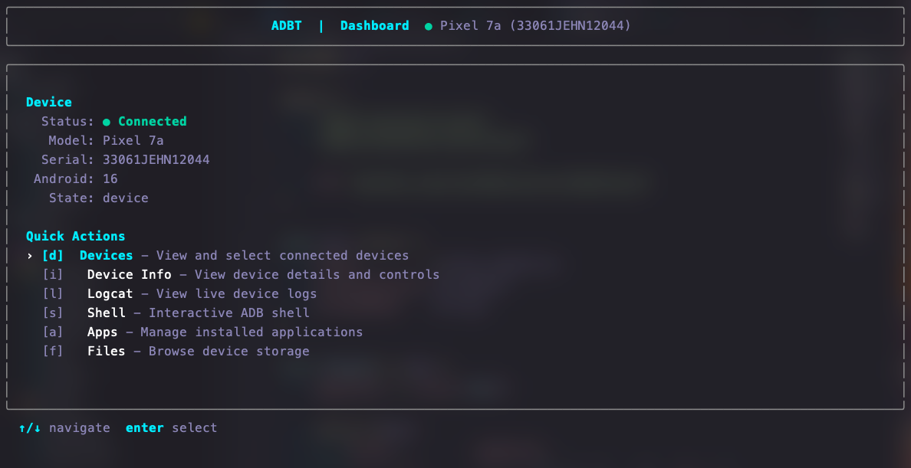

# adbt — Android Debug Bridge TUI

**adbt** is a modern, keyboard-driven **Terminal User Interface (TUI)** for interacting with Android devices using the Android Debug Bridge (ADB).
It provides a structured and interactive alternative to raw `adb` commands, focusing on clarity, correctness, and real-time device interaction entirely from the terminal.

Built in **Go** using **Charm’s Bubble Tea framework**.

---

## Screenshots

| Dashboard                               | Device Info                                 |
| --------------------------------------- | ------------------------------------------- |
|  |  |

---

## Features

### 🚀 Device Management
-   **Automatic Detection**: Real-time monitoring of connected devices.
-   **Wireless Pairing**: Pair devices via QR Code logic (IP/Port/PIN) directly from the terminal.
-   **Device Info**: View detailed stats (Battery, Storage, Resolution, Android Version).
-   **Power Controls**: Reboot, Recovery, Bootloader, and Screen Toggle.
-   **Scrcpy Integration**: Launch screen mirroring with a single keypress.

### 📊 Performance Monitor
-   **Real-time Stats**: CPU, Memory, and Network usage monitoring.
-   **Visual Graphs**: Live progress bars for system resource consumption.

### 📦 App Manager
-   **List & Search**: Browse all installed applications.
-   **Filtering**: Toggle between User and System apps.
-   **Actions**:
    -   Launch App
    -   Force Stop
    -   Clear Data
    -   Uninstall

### 📂 File Explorer
-   **Browse**: Navigate the device file system.
-   **Transfer**: Pull files from device to your computer.
-   **Manage**: Delete files and directories with confirmation.

### 📝 Logcat Viewer
-   **Live Streaming**: Real-time logs.
-   **Filtering**: Filter by log level (Debug, Info, Error, Fatal).
-   **Search**: Text search with highlighting.

---

## Installation

### Homebrew (macOS / Linux)
```bash
brew install --cask SakshhamTheCoder/tap/adbt
# or
brew tap SakshhamTheCoder/tap
brew install --cask adbt
```

### Scoop (Windows)
```powershell
scoop bucket add SakshhamTheCoder https://github.com/SakshhamTheCoder/scoop-bucket
scoop install adbt
```

### Linux Packages
Download the `.deb` or `.rpm` files from the [Releases Page](https://github.com/SakshhamTheCoder/adbt/releases).

### Go Install
```bash
go install github.com/SakshhamTheCoder/adbt/cmd/adbt@latest
```

---

## Keyboard Shortcuts

### Global
| Key | Action |
| --- | --- |
| `q` / `Ctrl+C` | Quit |
| `Esc` | Back / Cancel |
| `↑` `↓` / `k` `j` | Navigate |
| `Enter` | Select / Confirm |

### Dashboard
| Key | Action |
| --- | --- |
| `d` | Devices |
| `m` | Performance Monitor |
| `a` | App Manager |
| `f` | File Explorer |
| `l` | Logcat |
| `i` | Device Info |

### App Manager
| Key | Action |
| --- | --- |
| `/` | Search |
| `f` | Filter (User/System) |
| `s` | Force Stop |
| `x` | Clear Data |
| `u` | Uninstall |
| `Enter` | Launch |

### File Explorer
| Key | Action |
| --- | --- |
| `p` | Pull File |
| `d` | Delete |
| `Backspace` | Go Up |

---

## Contributing
Contributions are welcome! Fork the repository, create a feature branch, and submit a pull request.

## License
MIT License
