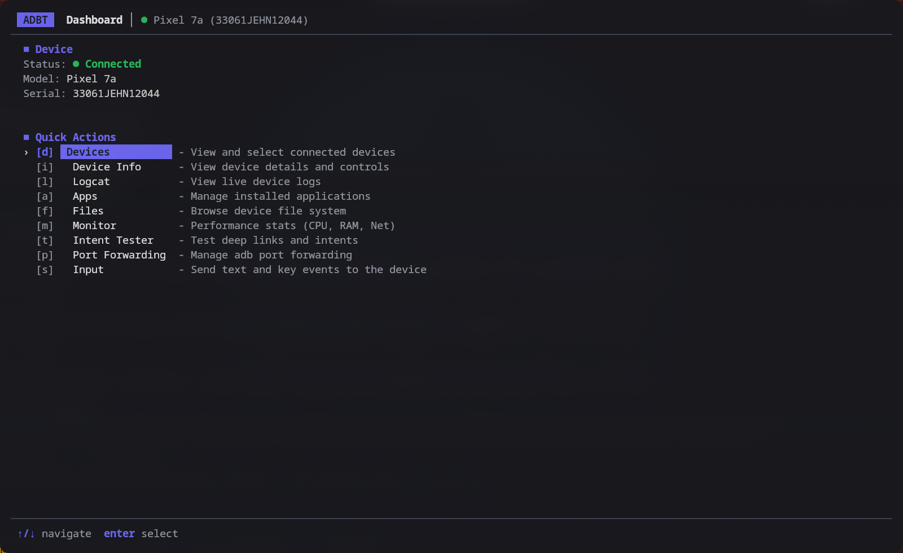
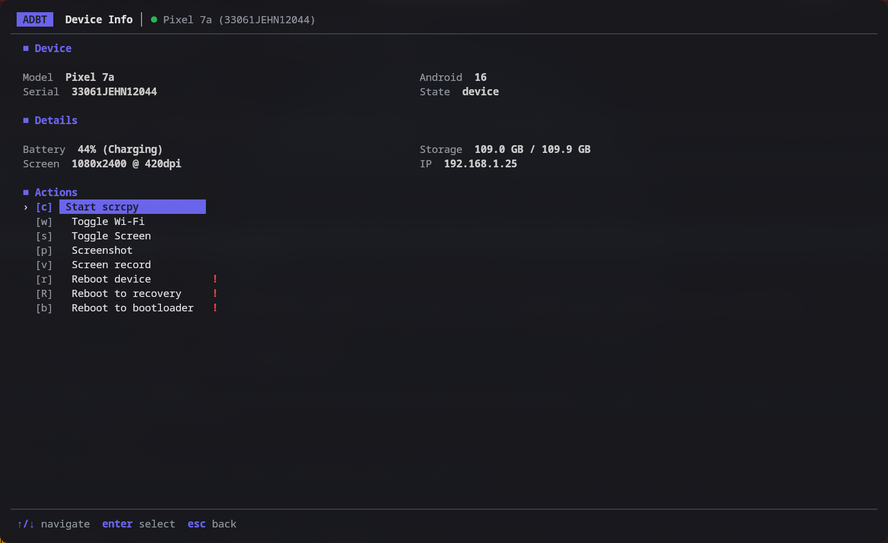
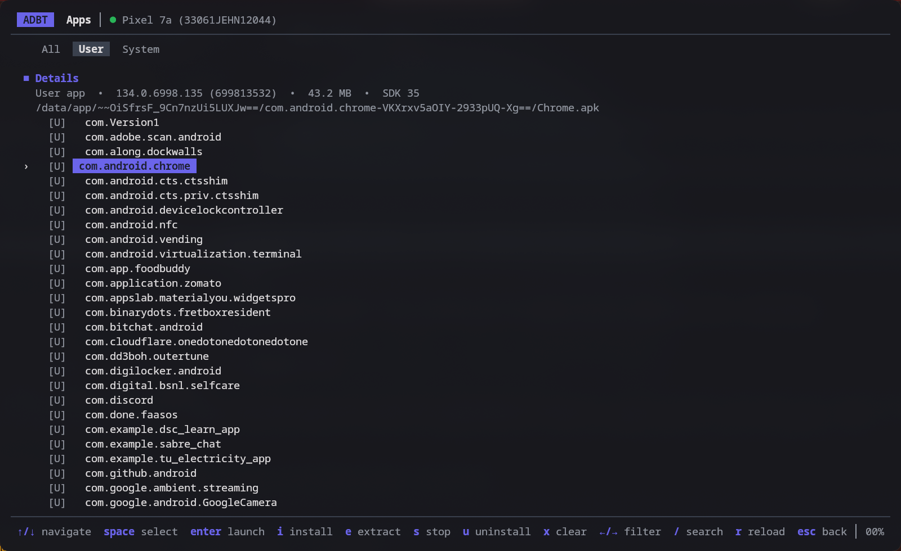
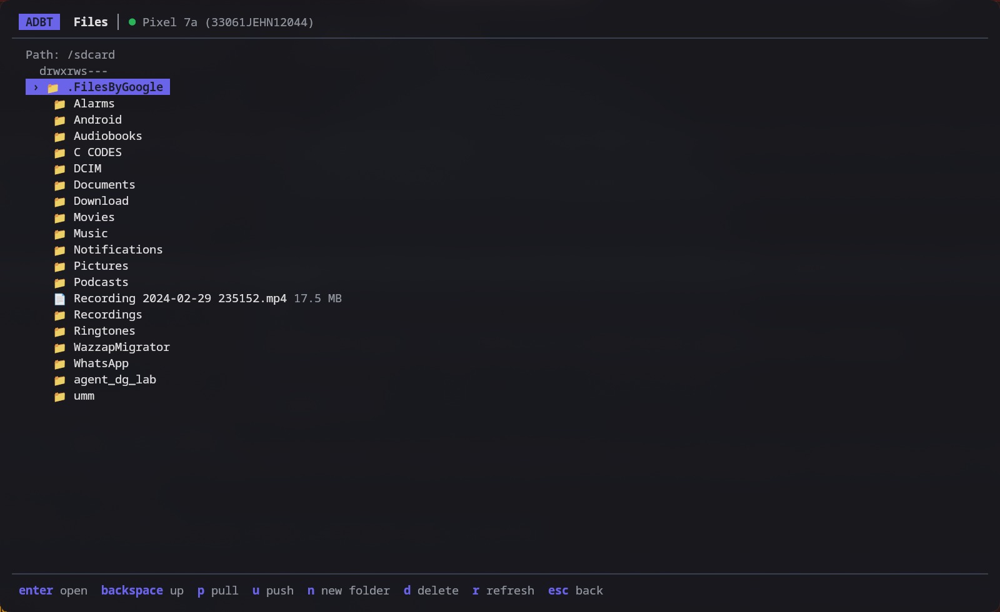
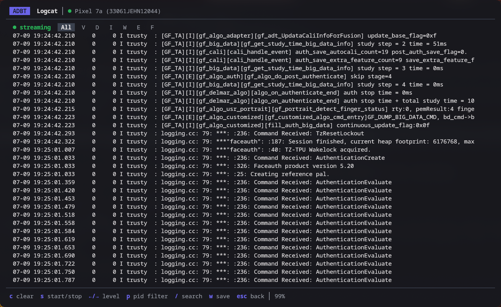
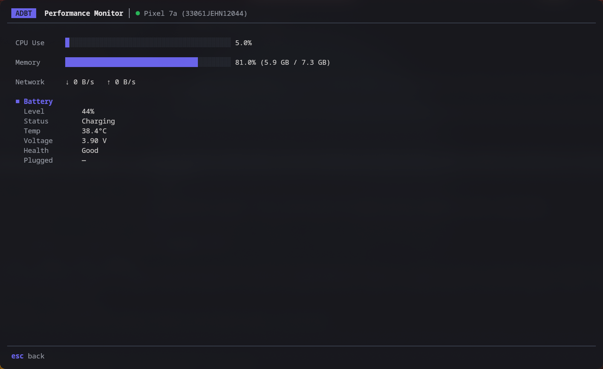
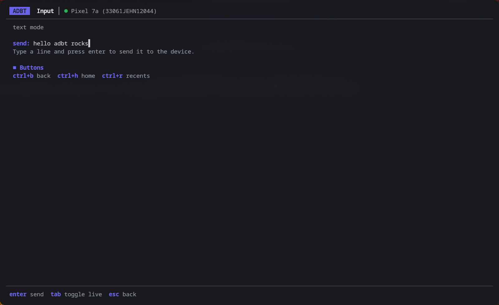

<p align="center">
  
</p>

<h1 align="center">adbt</h1>

<p align="center">
  <b>A modern, keyboard-driven Terminal User Interface (TUI) for Android Debug Bridge.</b>
</p>

<p align="center">
  <a href="https://adbt-tui.vercel.app"><b>Documentation Website »</b></a>
</p>

<p align="center">
  
  
  
</p>

---

**adbt** is a fast, keyboard-driven terminal user interface for interacting with Android devices via ADB. Built in Go using Charm’s **Bubble Tea** framework, it provides a structured and interactive command-line workspace that helps you avoid complex raw shell commands and context-switching.

For detailed guides, shortcuts, and troubleshooting, visit the [adbt Documentation Website](https://adbt-tui.vercel.app).

---

## ⚡ Core Features

- **Device Management**: Real-time connected device detection, wireless pairing over IP/port/PIN, and automatic selection when a single device is attached.
- **Device Info**: Model, serial, Android version, battery, storage, screen size/density, and IP address, plus Wi-Fi and screen toggles and reboot controls (device, recovery, bootloader).
- **Scrcpy Integration**: Launch high-performance screen mirroring with a single keypress.
- **Screen Capture**: Take screenshots and record the screen straight from Device Info, saved to your host machine.
- **Performance Monitor**: Real-time CPU, memory, and network usage, plus live battery level, temperature, voltage, and health readouts.
- **App Manager**: Browse, search, and filter user/system apps; inspect per-app details (version, size, target SDK, APK path); multi-select for batch uninstall; install or extract APKs; and launch, force-stop, or clear data.
- **File Explorer**: Browse the device filesystem, push and pull files, create directories, and delete with confirmation.
- **Logcat Viewer**: Live stream device logs with severity filters, text search highlighting, filtering by package/PID, pause/resume, clear, and one-key save to a file.
- **Input Sender**: Type text and send key events (Back, Home, Recents, arrows, and more) to the device, with an optional live keystroke-forwarding mode.
- **Intent Tester**: Construct and send custom activity/broadcast intents to test deep links and receiver behavior.
- **Port Forwarding**: Easily configure forward and reverse network connections between your host and device.

<details>
<summary><b>📷 View Screenshots Gallery</b></summary>
<br />

| Dashboard | Device Info |
| :---: | :---: |
|  |  |

| App Manager | File Explorer |
| :---: | :---: |
|  |  |

| Logcat Viewer | Performance Monitor |
| :---: | :---: |
|  |  |

| Input Sender | Intent Tester |
| :---: | :---: |
|  |  |

| Port Forwarding | |
| :---: | :---: |
|  | |

</details>

---

## 📦 Quick Installation

### Homebrew (macOS / Linux)
```bash
brew install --cask SakshhamTheCoder/tap/adbt
# or
brew tap SakshhamTheCoder/tap && brew install --cask adbt
```

### Scoop (Windows)
```bash
scoop bucket add SakshhamTheCoder https://github.com/SakshhamTheCoder/scoop-bucket
scoop install adbt
```

### AUR (Arch Linux)
```bash
yay -S adbt-bin
# or
paru -S adbt-bin
```

For manual binary downloads (`.deb`, `.rpm`, or generic archives), check the [Releases Page](https://github.com/SakshhamTheCoder/adbt/releases) or the [Installation Docs](https://adbt-tui.vercel.app/docs/installation).

---

## ⌨️ Essential Navigation

Once installed, plug in your device and run:
```bash
adbt
```

Check which build you're on with `adbt --version` (or `adbt -v`). `adbt` requires `adb` on your `PATH` and exits with install instructions if it is missing.

| Key | Action |
| :--- | :--- |
| `q` / `Ctrl+C` | Quit `adbt` |
| `Esc` / `Backspace` | Back / Go Up a directory |
| `↑` `↓` / `k` `j` | Navigate lists and menus |
| `Enter` | Select / Confirm / Launch |

For the full set of module-specific hotkeys (App Manager, File Explorer, Logcat, etc.), refer to the [Keyboard Shortcuts Cheat Sheet](https://adbt-tui.vercel.app/docs/shortcuts).

---

## 🛠️ Troubleshooting & Support

If you encounter connection issues, unauthorized device screens, or missing ADB paths:
- Consult the [Troubleshooting & FAQs Guide](https://adbt-tui.vercel.app/docs/troubleshooting).
- Open an issue on our [GitHub Issue Tracker](https://github.com/SakshhamTheCoder/adbt/issues).

## 📄 License

This project is licensed under the [MIT License](LICENSE).
